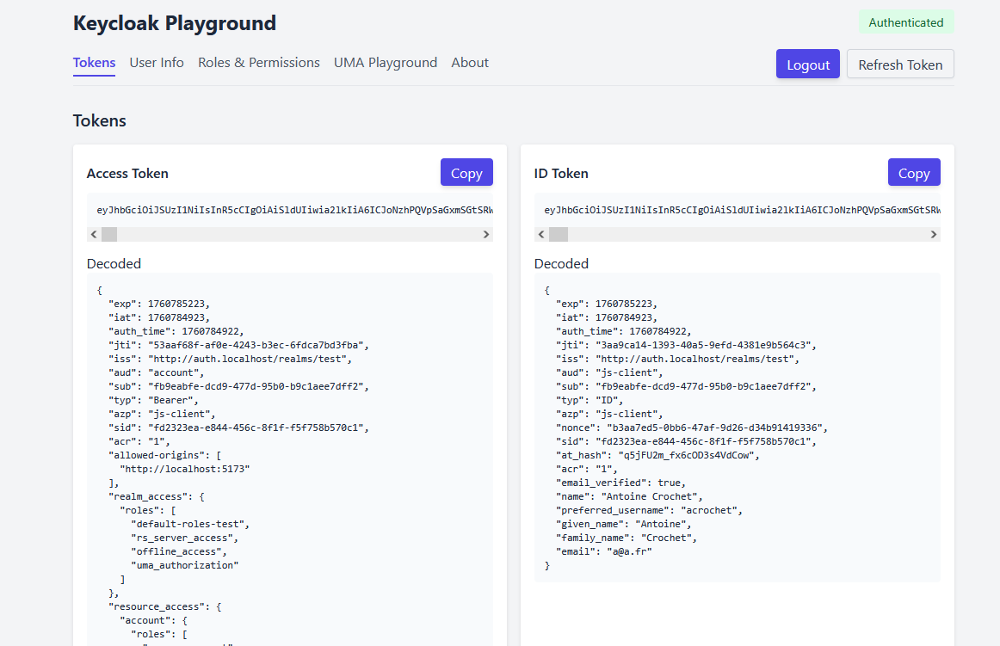
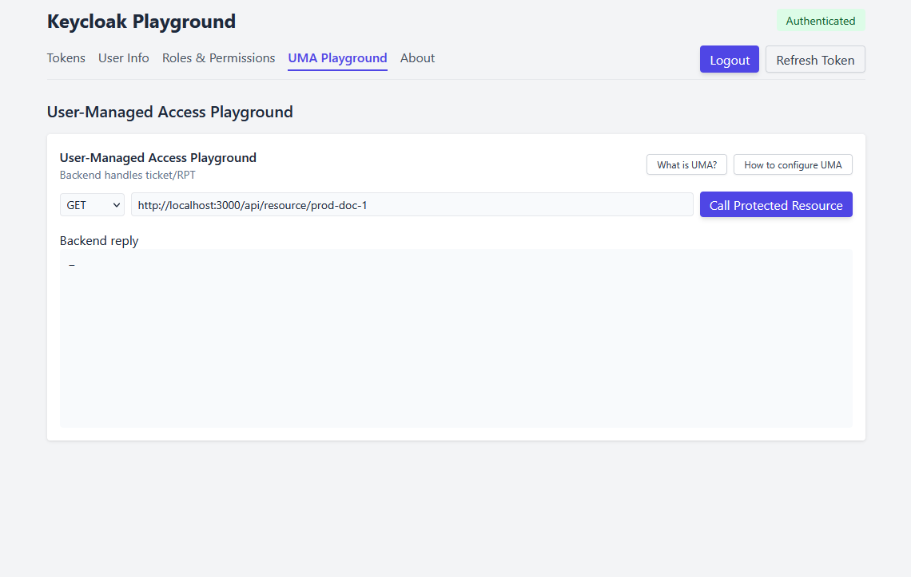

# 🧪 Keycloak Playground

[](LICENSE)
[](https://hub.docker.com/r/antoinecrochet/keycloak-playground)
[](https://github.com/antoinecrochet/keycloak-playground/releases)

A lightweight and interactive **Keycloak Playground** to experiment with:

- 🔐 Authentication using Keycloak
- 🧠 UMA (User-Managed Access)
- 🧾 Tokens (Access & ID)
- 👥 Roles & Permissions
- ℹ️ User information

The goal of this project is to provide a **ready-to-use demo** environment to test Keycloak features without complex setup.

---

## ✨ Features

- Login / Logout with Keycloak
- View Access & ID tokens (raw and decoded)
- UMA Playground — request protected resources
- Roles & Permissions viewer
- Simple “About” page (version info)
- Docker-ready for quick deployment

---

## 🖼️ Screenshots

| Login Page | UMA Playground |
|------------|---------------|
|  |  |

---

## 🚀 Run with Docker

You can quickly run the **frontend** and **backend** using Docker images published on [Docker Hub](https://hub.docker.com/u/antoinecrochet).

### Frontend

```bash
docker run -d \
  -p 8080:80 \
  -e VITE_KEYCLOAK_URL="http://auth.localhost" \
  -e VITE_KEYCLOAK_REALM="test" \
  -e VITE_KEYCLOAK_CLIENT_ID="js-client" \
  -e VITE_API_BASE_URL="http://localhost:3000" \
  antoinecrochet/keycloak-playground:latest
````

Access the UI at 👉 [http://localhost:8080](http://localhost:8080)

### Backend

```bash
docker run -d \
  -p 3000:3000 \
  -e KEYCLOAK_URL="http://auth.localhost" \
  -e KEYCLOAK_REALM="test" \
  -e KEYCLOAK_CLIENT_ID="rs-server" \
  -e KEYCLOAK_CLIENT_SECRET="***" \
  -e FRONTEND_URL="http://localhost:8080"
  antoinecrochet/keycloak-playground-backend:latest
```

The backend is optional — it’s only required for UMA testing.

---

## 🛠️ Run locally (development)

If you want to modify or extend the playground:

### 1. Clone the repo

```bash
git clone https://github.com/antoinecrochet/keycloak-playground.git
cd keycloak-playground
```

### 2. Frontend setup

```bash
cd frontend
npm install
npm run dev
```

Frontend will run by default on [http://localhost:5173](http://localhost:5173)

### 3. Backend setup

```bash
cd backend
npm install
npm run dev
```

Backend will run by default on [http://localhost:3000](http://localhost:3000)

---

## ⚙️ Environment Variables

| Variable                   | Description           | Default                 |
| -------------------------- | --------------------- | ----------------------- |
| `VITE_KEYCLOAK_URL`        | Keycloak base URL     | `http://auth.localhost` |
| `VITE_KEYCLOAK_REALM`      | Keycloak Realm        | `test`                  |
| `VITE_KEYCLOAK_CLIENT_ID`  | Frontend client ID    | `js-client`             |
| `VITE_API_BASE_URL`        | Backend API URL       | `http://localhost:3000` |
| `KEYCLOAK_URL` (backend)   | Keycloak base URL     | `http://auth.localhost` |
| `KEYCLOAK_REALM` (backend) | Keycloak Realm        | `test`                  |
| `KEYCLOAK_CLIENT_ID` (backend)      | Backend client ID     | `rs-server`             |
| `KEYCLOAK_CLIENT_SECRET` (backend)  | Backend client secret |                         |
| `FRONTEND_URL` (backend)  | Frontend URL for CORS | `http://localhost:5173` |

---

## 🔐 Keycloak configuration guide

To use the playground, you need a running Keycloak server.

Minimum configuration:

1. **Create a Realm** (e.g. `test`).
2. **Create a public client** (e.g. `js-client`)

   * Access Type: `public`
   * Valid redirect URIs: `http://localhost:5173/*` (or your deployment URL)
   * Web Origins: `+`
3. (Optional for UMA) **Create a confidential client** (e.g. `rs-server`) with service account enabled.

   * Access Type: `confidential`
   * Authorization : `enabled`
   * Configure resources and authorization policies in Keycloak Authorization tab.

Once this is done, set the environment variables accordingly (`.env` or Docker env vars).

---

## 🧪 UMA Testing (optional)

If backend is running, you can:

* Call a protected resource from the UMA Playground tab.
* Keycloak will issue an **UMA ticket** and the backend will exchange it for an **RPT**.
* You can configure resources and permissions in Keycloak without modifying your backend code.

Advantages:

* Authorization is centralized in Keycloak.
* Easy to adjust permissions without redeploying your API.

---

## 🧭 Project Structure

```
keycloak-playground/
├── frontend/          # React + Vite UI
├── backend/           # Node.js API (UMA + token handling)
├── docs/              # Screenshots & documentation
├── .github/workflows/ # CI/CD pipeline
└── README.md
```

---

## 🐳 Docker Hub

| Image                                     | Description           | Link                                                                           |
| ----------------------------------------- | --------------------- | ------------------------------------------------------------------------------ |
| `antoinecrochet/keycloak-playground`         | Frontend UI           | [Docker Hub](https://hub.docker.com/r/antoinecrochet/keycloak-playground)         |
| `antoinecrochet/keycloak-playground-backend` | Backend (Node.js API) | [Docker Hub](https://hub.docker.com/r/antoinecrochet/keycloak-playground-backend) |

---

## 📜 License

This project is licensed under the **MIT License**.
See [LICENSE](LICENSE) for details.

---

## 🧠 Learn more

- [Keycloak Documentation](https://www.keycloak.org/documentation)
- [UMA 2.0 Spec](https://datatracker.ietf.org/doc/html/draft-ietf-oauth-uma-grant-02)
- [Docker Hub](https://hub.docker.com/)

---

👨‍💻 **Author:** [Antoine Crochet](https://github.com/antoinecrochet)
⭐ If you like this project, consider giving it a star on [GitHub](https://github.com/antoinecrochet/keycloak-playground)!
